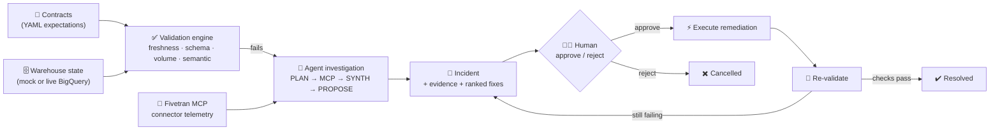
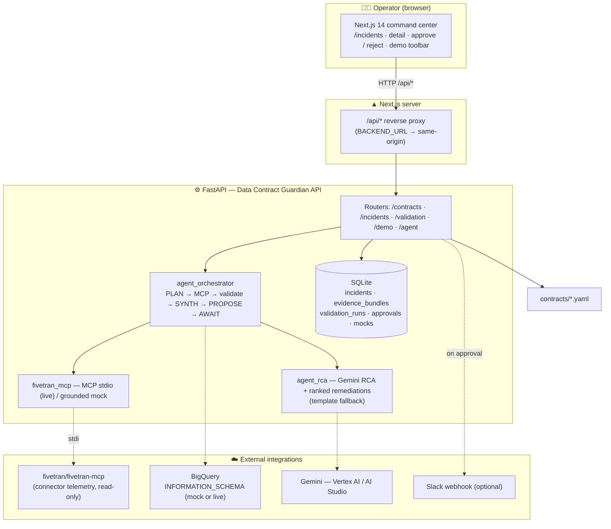
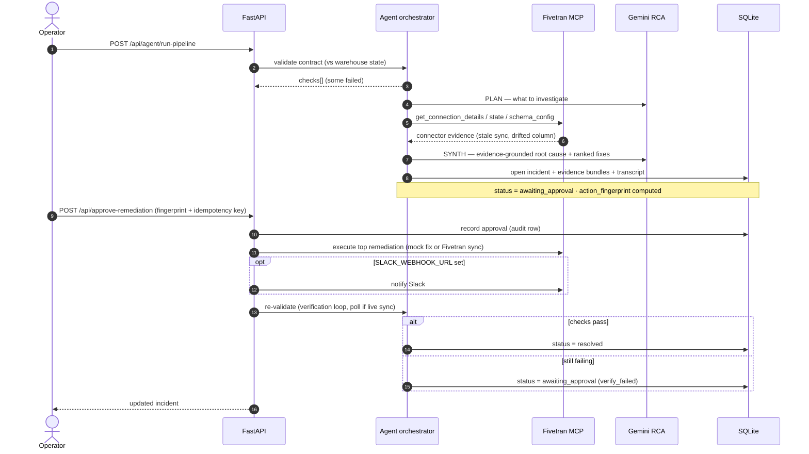
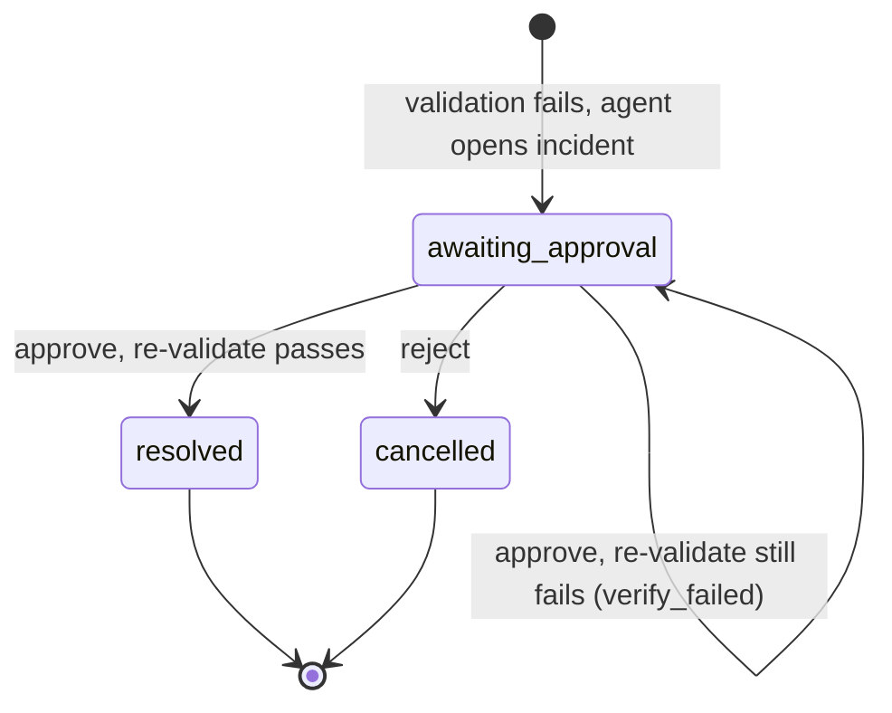

# Data Contract Guardian


**AI-native data reliability for Fivetran → BigQuery pipelines**

> An operational agent validates **data contracts** against warehouse state and **Fivetran**
> connector signals, produces **evidence-grounded** incident intelligence, and runs
> **human-approved** remediation with verification — moving beyond chat into **tool use and
> closed-loop** workflows.

**Hosted demo:** [UI](https://data-contract-guardian-ui-920722415791.us-central1.run.app) · [API](https://data-contract-guardian-api-920722415791.us-central1.run.app) · [Swagger `/docs`](https://data-contract-guardian-api-920722415791.us-central1.run.app/docs)

Built with **Google Cloud Agent Builder (ADK)** · **Gemini** · the **Fivetran MCP server** · **BigQuery**.


---

## The problem

Modern analytics and AI features depend on **warehouse marts** fed by **ELT** (for example
Fivetran into BigQuery). When **schema drifts**, **syncs slip**, or **volumes diverge**,
dashboards and downstream models break quietly — often discovered first by business users. Data
teams lose hours correlating **connector telemetry**, **SQL checks**, and **tickets**, and repeat
the same investigations without durable **evidence** or **audit trails**.

## What Data Contract Guardian does

A **single reliability control plane**: declare contracts in YAML, compare them to mock or live
warehouse state and **Fivetran** connector telemetry, open **incidents** with ranked remediation
options, and require **explicit approval** before side effects (for example Slack) while
**re-validating** after action.

| Capability | Role |
| ---------- | ---- |
| **Contract registry** | Versioned YAML expectations (freshness, schema, volume, semantic SQL). |
| **Validation engine** | Runs checks per contract; persists **validation runs** with structured `checks[]`. |
| **Fivetran MCP integration** | Three MCP tools over **stdio** (`fivetran-mcp`), or grounded mock evidence for offline runs. |
| **Agent orchestrator** | Multi-step Agent Builder pattern: PLAN → MCP → validate → SYNTH → PROPOSE → AWAIT. |
| **Human-in-the-loop** | Fingerprinted **approve / reject** with optional idempotency keys and audit rows. |
| **Verification loop** | Re-runs validation after approval; moves incidents to **resolved** when checks pass. |
| **Command-center UI** | Next.js: incidents, MCP trace panel, platform status, detail transcript, HITL approval gate. |
| **Judge APIs** | `GET /api/agent/platform`, `POST /api/agent/discover/{id}` with `mcp_trace` + `summary_for_agent`. |

## Why it is agentic

Data Contract Guardian is not a single LLM call — it orchestrates a multi-step workflow with guardrails:

| Agent behavior | Implementation |
| -------------- | -------------- |
| **Discovery** | Validates contracts against mock or live BigQuery; calls three read-only Fivetran MCP tools per failure |
| **Reasoning** | Gemini PLAN + SYNTH (Vertex AI or AI Studio) with deterministic fallback when no model is configured |
| **Evidence grounding** | Every RCA ties to persisted `evidence_bundles[]` and structured `checks[]` — mock narratives match the actual failure type |
| **Human gate** | Remediation blocked until operator approves the `action_fingerprint` in the UI |
| **Verification loop** | Post-approval re-validation against live or mock warehouse — `resolved` or `verify_failed` |
| **Audit trail** | SQLite: incidents, transcript events, approvals, validation runs, resolution memory |

The agent proposes and coordinates; **humans approve**. Nothing with a side effect runs on autopilot.

## Google Cloud usage

| Service | Role in this project | Status |
| ------- | -------------------- | ------ |
| **Gemini** | Investigation plan, evidence-grounded RCA, stakeholder summary (`gemini-3.5-flash` on Vertex `us-central1`) | Implemented |
| **Agent Builder (ADK)** | `McpToolset` → `fivetran/fivetran-mcp` over stdio; `adk web agent_builder` for local chat | Implemented |
| **Cloud Run** | Hosted UI + API (`us-central1`); frontend proxies `/api/*` to backend | Implemented |
| **BigQuery** | Live `INFORMATION_SCHEMA` + semantic SQL when `MOCK_BIGQUERY=false` | Implemented |
| **Artifact Registry** | Container images for backend and frontend | Implemented |
| **Secret Manager** | Fivetran API key/secret injected into Cloud Run when live MCP is enabled | Implemented |
| **Terraform** | IaC for Cloud Run, IAM, secrets, scaling | Implemented |

## Fivetran integration (partner track)

Fivetran is the **data movement layer**: Airtable → BigQuery (Fivetran destination schema); Data Contract Guardian validates landed tables and investigates failures with connector telemetry. Set **`BQ_DATASET`** when contract YAML still uses the demo placeholder `network`.

**MCP (primary):** [fivetran/fivetran-mcp](https://github.com/fivetran/fivetran-mcp) over stdio, read-only (`FIVETRAN_ALLOW_WRITES=false`). Investigation tools:

- `get_connection_details` — sync health, setup state
- `get_connection_state` — sync/update state
- `get_connection_schema_config` — enabled tables and schema config

Each API response includes an **`mcp_trace`** (per-tool ok/error summary) for judges and ADK chat agents.

**Connection resolution:** contracts use alias `ft_airtable_network`; runtime resolves to your dashboard connection slug via `list_connections`, or set `FIVETRAN_CONNECTION_ID` explicitly.

Setup guide: [docs/FIVETRAN.md](./docs/FIVETRAN.md).

## Safety model

Designed so reliability actions cannot run by accident:

1. **Read-only MCP by default** — connector writes disabled; remediation side effects wait behind approval
2. **Fingerprint-gated approval** — `action_fingerprint` must match; tampered plans are rejected
3. **Idempotent approvals** — safe to retry with the same `idempotency_key` (`duplicate: true`)
4. **Live verification** — approval **executes** the top remediation (mock fix or Fivetran sync via REST), then re-validates with polling; counts come from checks, not self-reported text
5. **Evidence honesty** — degraded MCP tools surface as errors in `mcp_trace`; the agent does not fabricate connector telemetry
6. **Agent vs UI split** — read-only `POST /api/agent/discover/{id}` for chat; approve/reject only via UI or `POST /api/incidents/approve-remediation`
7. **Gemini is advisory** — RCA and remediations fall back to deterministic templates when Gemini is unavailable

## How it works (60-second tour)



1. **Declare** expectations as versioned YAML contracts (freshness windows, required columns, types, volume variance, semantic SQL).
2. **Validate** each contract against warehouse state — mock for offline demos, or live BigQuery `INFORMATION_SCHEMA`.
3. **Investigate** every failure with a multi-step agent that pulls **Fivetran MCP** connector evidence and synthesizes an **evidence-grounded** root cause + ranked remediations.
4. **Open an incident** with a stable `action_fingerprint`, persisted evidence bundles, and a replayable agent transcript.
5. **Approve** (human-in-the-loop) — the backend executes the top-ranked fix, re-runs validation (polls up to ~90s after live sync), and moves the incident to **resolved** or back to **awaiting_approval** with `verify_failed`.

> **Try it in 3 clicks, no credentials:** *Seed failing → Run agent pipeline → Approve.* Jump to [Demo flow](#demo-flow).

## Demo flow

Example walkthrough on the hosted UI or locally (mock warehouse — no GCP/Fivetran credentials):

```
Seed failing (all contracts)
        │
        ▼
Run agent pipeline ──► 6 contracts validated · failures open incidents (~40s live)
        │              each incident: 8-step transcript + 3 MCP evidence bundles
        ▼
Open incident ──► inspect MCP trace + agent transcript + column-specific remediations
        │
        ▼
Human approval ──► checkbox confirm · fingerprint match · idempotent retry supported
        │
        ▼
Re-validate ──► live BigQuery or mock warehouse
        │
        ├── checks pass ──► status = resolved
        └── still failing ──► awaiting_approval + remediation_status = verify_failed
```

| Step | What to click / call | What you should see |
| ---- | -------------------- | ------------------- |
| 1 | **Seed failing** | Mock warehouse state violates each contract's schema/freshness rules |
| 2 | **Run agent pipeline** | `POST /api/agent/run-pipeline` — incidents for failed contracts, `mcp_trace` on each outcome |
| 3 | Open incident | Transcript: PLAN → TOOL (×3) → SYNTH → PROPOSE → AWAIT |
| 4 | **Approve & re-verify** | Requires checkbox; backend re-runs validation |
| 5 | **Seed passing** → approve again | Incident moves to **resolved** when checks pass |

**Live mode** (`MOCK_BIGQUERY=false`, `MOCK_FIVETRAN_MCP=false`): use **Run live validation** / **Run live agent pipeline** on the Incidents page — incidents open only when real contracts fail against BigQuery.

## Datasets & contracts

The repo guards a **network** BigQuery dataset synced from **Airtable** via Fivetran, with
**6 data contracts** across **5 tables**:

| Dataset | Fivetran connector | Source | Tables |
| ------- | ------------------ | ------ | ------ |
| `network` | `ft_airtable_network` | Airtable | `cdr`, `data_session`, `cell_tower`, `network_alarm`, `signal_sample` |

Failing state is **derived from each contract's own schema and freshness window**, so seeded
incidents are real (never hand-faked) and the agent's evidence stays honestly grounded. See
[`contracts/`](./contracts/).

### Live Fivetran → BigQuery pipeline

To validate contracts against **real** Airtable-synced tables (not mock warehouse state):

| Phase | What to do | Guide |
| ----- | ---------- | ----- |
| 1. Ingest | Airtable connector → BigQuery `network` dataset | [docs/FIVETRAN.md § Step 2](./docs/FIVETRAN.md#step-2--data-ingestion-setup-airtable--bigquery) |
| 2. Align | Set `GCP_PROJECT_ID` / `FIVETRAN_CONNECTION_ID` (or update contract YAML) | [docs/FIVETRAN.md § Step 3](./docs/FIVETRAN.md#step-3--align-data-contracts-with-your-pipeline) |
| 3. Validate | `MOCK_BIGQUERY=false` + GCP credentials | [docs/FIVETRAN.md § Step 4](./docs/FIVETRAN.md#step-4--enable-live-bigquery-validation) |
| 4. Investigate | `MOCK_FIVETRAN_MCP=false` + API key/secret | [docs/FIVETRAN.md § Steps 5–6](./docs/FIVETRAN.md#step-5--run-the-fivetran-mcp-server) |

The demo works **without** any of the above — mocks cover both warehouse and MCP.

## Core concepts

A small vocabulary that the API, UI, and docs all share:

| Term | Meaning |
| ---- | ------- |
| **Data contract** | A versioned YAML expectation for one table: freshness window, required columns/types, optional volume variance, and semantic SQL checks. Lives in [`contracts/`](./contracts/). |
| **Check** | One assertion inside a contract (e.g. *freshness*, *schema*, *volume*, *semantic*). Validation returns a structured `checks[]` with pass/fail per check. |
| **Validation run** | A persisted record of running all checks for a contract against warehouse state — the source of truth incidents are grounded in. |
| **Evidence bundle** | Persisted JSON from a Fivetran MCP tool call (connector details / state / schema config). Every RCA claim references a bundle id. |
| **Incident** | An open reliability problem for a failing contract, carrying severity, root cause, ranked remediations, evidence ids, and an agent transcript. |
| **Agent transcript** | The replayable, step-stamped log of the investigation (PLAN → MCP → validate → SYNTH → PROPOSE), shown verbatim in the UI. |
| **Ranked remediations** | Ordered candidate fixes the agent proposes; the operator approves one. |
| **Action fingerprint** | A stable hash over the ranked-remediation plan. Approval must match it, so a human can't approve a plan that silently changed underneath them. |
| **Idempotency key** | Optional client-supplied key making approval safe to retry without double-acting. |
| **Verification loop** | After approval the backend re-validates; passing → `resolved`, still failing → back to `awaiting_approval` flagged `verify_failed`. |
| **MCP** | Model Context Protocol — how the agent talks to the Fivetran server (over stdio), live or mocked. |

## Architecture

Data Contract Guardian splits **UI** (Next.js), **HTTP API** (FastAPI), and **persistent state**
(SQLite). In cloud deploys, the UI service **proxies** `/api/*` to the API service so browsers
stay same-origin.

### System context



**Protocols:** **MCP** (Fivetran server over stdio) · **Gemini** on Vertex AI · **Google Cloud
Agent Builder** (ADK + `McpToolset`).

### Agent investigation & human-in-the-loop

The agent never acts blind and never acts alone — every claim ties to persisted evidence, and
every side effect waits behind an approval gate.



### Incident lifecycle



**Severity** is derived from the failed checks (`critical` · `high` · `medium` · `low`), so it
reflects the real validation outcome rather than a hand-set label.

### Pipeline

| Step | Component | Purpose |
| ---- | --------- | ------- |
| 1 | Demo API | `POST /api/demo/seed-*` — set warehouse state (passing/failing) per contract. |
| 2 | Agent pipeline | `POST /api/agent/run-pipeline` — validate + Fivetran MCP + open incidents. |
| 3 | UI | Inspect transcript + evidence bundles + ranked remediations. |
| 4 | HITL | `POST /api/approve-remediation` — approve fingerprinted plan. |
| 5 | Verification | Backend executes remediation, re-runs validation; resolves or **verify_failed**. |

## Tech stack

| Layer | Technology |
| ----- | ---------- |
| **Language** | Python 3.12 · TypeScript (frontend) |
| **API** | FastAPI · Uvicorn |
| **Frontend** | Next.js 14 (App Router) · React · Tailwind CSS |
| **Persistence** | SQLite (dev / demo); `/tmp` in containers |
| **AI** | Google Gemini via Vertex AI (or AI Studio key); safety filters applied |
| **Agent framework** | Google Cloud Agent Builder (ADK) + `McpToolset` |
| **Data integration** | Fivetran **MCP** server (`fivetran/fivetran-mcp`) over stdio |
| **Warehouse** | BigQuery (`INFORMATION_SCHEMA`) — mock or live |
| **Notifications** | Slack Incoming Webhook (optional) |
| **IaC / cloud** | Terraform · Artifact Registry · **Cloud Run** (API + UI) · Secret Manager |
| **Containers** | Docker (`deploy/Dockerfile.*`) |

## Repository structure

```
contracts/                 YAML data contracts (network dataset, 6 contracts)
backend/
├── app/
│   ├── main.py            FastAPI entry, CORS, routes
│   ├── config.py          Pydantic settings
│   ├── db.py              SQLite bootstrap
│   ├── schemas.py         Shared models
│   ├── routers/           contracts, incidents, validation, demo, agent
│   └── services/          validation, incidents, Fivetran MCP, remediation_executor, agent_rca
├── agent_builder/         ADK agent + Fivetran MCPToolset
├── requirements.txt
└── data/                  local SQLite (gitignored)

frontend/
├── app/                   pages + /api/[[...path]] proxy
├── components/guardian/   Agent pipeline, MCP discovery, system status, workflow stepper
├── lib/api.ts             Server fetch helpers
└── package.json

docs/                      Implementation, deployment, Fivetran guides
deploy/                    Dockerfiles
terraform/                 GCP: Artifact Registry, Cloud Run, Secret Manager
scripts/                   gcp-push-images.sh
```

## Key design decisions

* **Evidence-first incidents** — every RCA claim ties to a **persisted evidence bundle id** and a
  real failing check, not free-floating LLM text. The Fivetran MCP evidence names the actual
  drifted column / stale sync, grounded in the validation outcome.
* **Mock-before-live** — Fivetran MCP and the warehouse are **mockable**, so anyone can reproduce
  incidents without production credentials; flip env flags to go live.
* **Read-only by default** — the Fivetran MCP server runs read-only (`FIVETRAN_ALLOW_WRITES=false`),
  and all side effects sit behind the human-in-the-loop approval gate.
* **Same-origin UI in cloud** — the Next `BACKEND_URL` proxy avoids browser CORS while Terraform
  injects the backend URL.
* **SQLite scope** — backend Cloud Run uses `max_instance_count = 1` for demo consistency; not multi-tenant durable without Cloud SQL (see [docs/DEPLOYMENT.md](./docs/DEPLOYMENT.md)).
* **Client-side MCP discovery** — Agent Home renders immediately; five-tool discovery loads in the background.

## Getting started

### Prerequisites

* Python **3.12+**
* Node.js **20+** and npm
* Optional: a **Gemini** backend (Vertex AI project or AI Studio key) for richer RCA; a
  **Fivetran** API key for live MCP (see [docs/FIVETRAN.md](./docs/FIVETRAN.md))

### Backend

```bash
cd backend
python -m venv .venv
source .venv/bin/activate   # Windows: .venv\Scripts\activate
pip install -r requirements.txt
```

Copy [`.env.example`](./.env.example) to `backend/.env` or export variables, then from `backend/`:

```bash
PYTHONPATH=. uvicorn app.main:app --reload --host 0.0.0.0 --port 8000
```

Open [http://127.0.0.1:8000/docs](http://127.0.0.1:8000/docs).

### Frontend

```bash
cd frontend
cp ../.env.example .env.local   # set BACKEND_URL=http://127.0.0.1:8000 for the /api proxy
npm install && npm run dev
```

Open [http://localhost:3000](http://localhost:3000).

### Quick start (clone → run)

```bash
git clone <your-repo-url> && cd data-contract-guardian

# Terminal 1 — API
cd backend && python -m venv .venv && source .venv/bin/activate
pip install -r requirements.txt
cp ../.env.example .env
PYTHONPATH=. uvicorn app.main:app --reload --port 8000

# Terminal 2 — UI
cd frontend && cp ../.env.example .env.local
# set BACKEND_URL=http://127.0.0.1:8000
npm install && npm run dev
```

Open [http://localhost:3000](http://localhost:3000) · API docs at [http://127.0.0.1:8000/docs](http://127.0.0.1:8000/docs).

### Demo flow (no credentials needed)

See [Demo flow](#demo-flow) above. Short version:

1. **Incidents** → **Seed failing** → **Run agent pipeline** → open an incident.
2. Inspect **MCP trace**, **agent transcript**, and **ranked remediations** → **Approve & re-verify**.
3. **Seed passing** → **Approve** again → **resolved**.

Optional: `SLACK_WEBHOOK_URL` on the API posts when remediation is approved.

### Tests & quality gates

```bash
cd backend && PYTHONPATH=. pytest -q          # MCP, HITL, remediation executor, pipeline
cd frontend && npm run build
cd terraform && terraform init -backend=false && terraform validate
```

CI runs backend tests and frontend build on every push (see `.github/workflows/ci.yml`).

## Capabilities (real vs mocked)

| Capability | Status |
| ---------- | ------ |
| Contract YAML registry + validation engine | Implemented |
| Mock warehouse seeding (deterministic failing/passing) | Implemented |
| Live BigQuery `INFORMATION_SCHEMA` validation | Implemented (`MOCK_BIGQUERY=false`) |
| Fivetran MCP stdio (3 investigation tools + `schema_file`) | Implemented when credentials set |
| Grounded mock MCP evidence (failure-type aware) | Implemented (offline default) |
| Evidence-aware ranked remediations | Implemented (`agent_rca.py`) |
| Remediation execution on approval | Implemented (`remediation_executor.py`, Fivetran REST sync) |
| ADK agent + `McpToolset` | Implemented |
| Gemini RCA + deterministic fallback | Implemented |
| HITL approve/reject + fingerprint + idempotency | Implemented |
| Post-approval verification loop | Implemented |
| `mcp_trace` + `summary_for_agent` on agent APIs | Implemented |
| `GET /api/agent/platform` workflow counters | Implemented |
| Slack webhook on approval | Implemented (optional env) |
| Multi-instance durable state on Cloud Run | Not implemented (SQLite per instance) |

## Environment variables

Full templates: **[`.env.example`](./.env.example)** · Deep dive: **[docs/DEPLOYMENT.md](./docs/DEPLOYMENT.md)**

| Variable | Required | Description |
| -------- | -------- | ----------- |
| `BACKEND_URL` | Yes on Next (cloud + recommended local) | FastAPI base URL for the `/api` proxy |
| `GEMINI_MODEL` | No | Gemini model id (default `gemini-3.5-flash`) |
| `GEMINI_FALLBACK_MODEL` | No | Fallback when primary unavailable in region |
| `GEMINI_LOCATION` | No | Vertex region (`us-central1` for 2.5; `global` for `gemini-3.5-*`) |
| `BQ_DATASET` | For live BQ | Fivetran destination schema when YAML has `network` placeholder |
| `GEMINI_SAFETY_THRESHOLD` | No | Safety filter level (default `BLOCK_ONLY_HIGH`) |
| `GCP_PROJECT_ID` / `GCP_LOCATION` | For Vertex + live BigQuery | Project and region (default `us-central1`) |
| `GEMINI_API_KEY` | No | AI Studio fallback when Vertex is unavailable |
| `USE_AGENT_BUILDER` | No | ADK orchestration when `google-adk` installed |
| `MOCK_FIVETRAN_MCP` | No | `true` (default) for mock; `false` for live MCP |
| `FIVETRAN_API_KEY` / `FIVETRAN_API_SECRET` | For live MCP | See [docs/FIVETRAN.md](./docs/FIVETRAN.md) |
| `FIVETRAN_CONNECTION_ID` | No | Real Fivetran connection slug when contracts use alias `ft_airtable_network` |
| `MOCK_BIGQUERY` | No | `true` (default) for mock warehouse; `false` for live checks |
| `CORS_ORIGINS` | No | API CORS list, or `*` for public access |
| `SLACK_WEBHOOK_URL` | No | Posts on the approval path |

## Documentation

| Guide | Purpose |
| ----- | ------- |
| [docs/README.md](./docs/README.md) | Engineering docs index |
| [docs/FIVETRAN.md](./docs/FIVETRAN.md) | Airtable → BigQuery ingestion, contracts, live validation, MCP |
| [docs/IMPLEMENTATION.md](./docs/IMPLEMENTATION.md) | Architecture, code layout, APIs, data flow |
| [docs/DEPLOYMENT.md](./docs/DEPLOYMENT.md) | Docker, Terraform, Cloud Run, Secret Manager |
| [docs/openapi/agent-api.yaml](./docs/openapi/agent-api.yaml) | Read-only agent API for Agent Builder import |
| [backend/agent_builder/README.md](./backend/agent_builder/README.md) | ADK local chat (`adk web agent_builder`) |
| [docs/SUBMISSION.md](./docs/SUBMISSION.md) | Hackathon submission narrative (Devpost copy) |

Interactive API: Swagger at `/docs` on the FastAPI host.

## Known limitations

* **SQLite on Cloud Run** — incident state lives on `/tmp` per instance; backend uses `min_instance_count = 1` for demo consistency. Not suitable for multi-tenant production without Cloud SQL or Firestore.
* **Cold start** — first request after scale-to-zero can take ~10–15s when MCP + Gemini spin up; set `min_instance_count = 1` on both services for demos.
* **Connector alias** — contracts reference `ft_airtable_network`; set `FIVETRAN_CONNECTION_ID` if auto-resolution cannot match your account.
* **Semantic checks** — run only when `MOCK_BIGQUERY=false` and BigQuery credentials are available.
* **GitHub MR execution** — SAFE_CAST MR proposals are coordination-only; native GitHub integration is a roadmap item. Fivetran sync on approval is implemented via REST.

## Roadmap

* Execute **BigQuery** contract checks in production (partition-aware, cost-capped).
* **dbt** manifest hints for blast radius; Composer / Airflow status in investigations.
* Replace SQLite with **Cloud SQL** or **Firestore** for multi-revision Cloud Run.

## License

MIT — see [`LICENSE`](./LICENSE).
