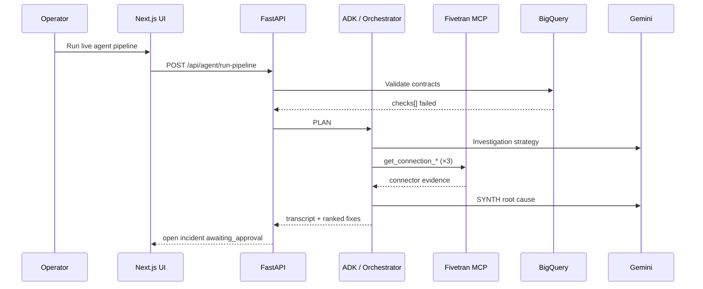
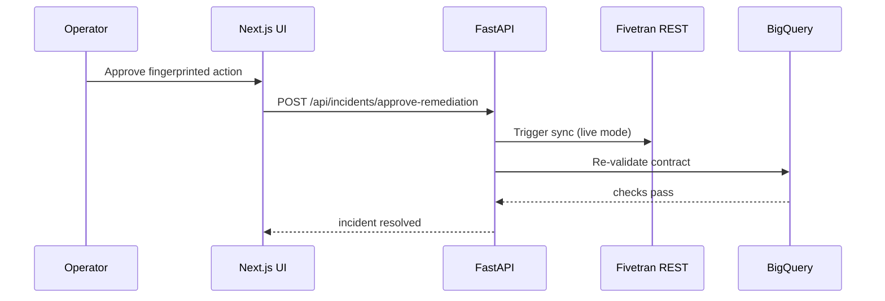
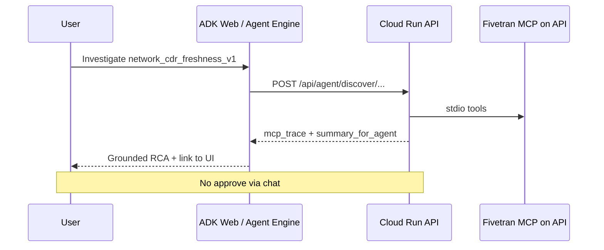

# Architecture

High-level design for **Data Contract Guardian**: how the UI, API, agent, Fivetran MCP, BigQuery, and optional chat surfaces fit together.

---

## Problem and approach

ELT pipelines (Fivetran → BigQuery) fail quietly — schema drift, stale syncs, volume drops. Business users notice before data teams do.

Data Contract Guardian treats reliability as an **agentic workflow**:

1. **Declare** expectations in YAML contracts
2. **Validate** against mock or live BigQuery
3. **Investigate** failures with read-only Fivetran MCP tools + Gemini
4. **Propose** ranked, evidence-aware remediations
5. **Gate** execution behind human approval (SHA-256 fingerprint)
6. **Verify** by re-running validation after remediation

---

## Runtime components

| Component | Technology | Role |
| --------- | ---------- | ---- |
| **UI** | Next.js 14 on Cloud Run | Command center: incidents, MCP trace, HITL approval |
| **API** | FastAPI on Cloud Run | Orchestration, validation, incidents, agent APIs |
| **Agent (production)** | ADK `InMemoryRunner` in `backend/agent_builder/` | Same mission as orchestrator; `McpToolset` → Fivetran stdio |
| **Agent (chat)** | `guardian-adk/guardian_assistant/` | Standalone ADK package → Cloud Run `/api/agent/*` tools |
| **Gemini** | `google-genai` SDK | PLAN + SYNTH (Vertex AI or AI Studio API key) |
| **Fivetran** | Official MCP server over stdio | Read-only connector telemetry |
| **Warehouse** | BigQuery `INFORMATION_SCHEMA` | Freshness, schema, semantic SQL |
| **State** | SQLite (`/tmp/guardian.db` on Cloud Run) | Incidents, transcript, approvals, validation runs |
| **IaC** | Terraform | Cloud Run, Artifact Registry, Secret Manager, ADK staging GCS |

---

## Request flows

### Investigation (happy path)

### Human approval

### Chat agent (read-only)

On **Agent Engine**, native stdio MCP is off by default; Fivetran tools call `POST /api/agent/fivetran` on Cloud Run instead.

---

## Two ADK packages (why both exist)

| Package | Location | Used when |
| ------- | -------- | --------- |
| **Production ADK** | `backend/agent_builder/` | Cloud Run investigations (`USE_AGENT_BUILDER=true`); `McpToolset` in-process |
| **Chat ADK** | `guardian-adk/guardian_assistant/` | `adk web` local playground; Vertex **Agent Engine** deploy |

The chat agent does **not** duplicate business logic — it calls the hosted read-only API (`guardianPlatformStatus`, `guardianDiscoverContract`, `guardianMcpDiscovery`, Fivetran proxy tools).

---

## Safety boundaries

| Capability | Chat / discover APIs | UI / approve API |
| ---------- | -------------------- | ---------------- |
| Fivetran MCP read | ✓ | ✓ (during investigation) |
| Fivetran sync / MCP writes | ✗ | ✓ (after approval, via REST) |
| Open / resolve incidents | ✗ (discover may not open) | ✓ |
| BigQuery DML | ✗ | ✗ (validation only) |

MCP is **read-only** (`FIVETRAN_ALLOW_WRITES=false`). Sync on approval uses **Fivetran REST**, not MCP write tools.

---

## Google Cloud services

| Service | Usage |
| ------- | ----- |
| **Cloud Run** | Hosts UI + API (`us-central1`) |
| **Artifact Registry** | `backend` + `frontend` images |
| **Secret Manager** | Gemini API key, Fivetran credentials |
| **BigQuery** | Live contract validation |
| **Vertex AI** | Gemini (when not using AI Studio key) |
| **Vertex Agent Engine** | Optional hosted ADK playground |
| **Cloud Storage** | ADK deploy staging bucket |
| **IAM** | Backend SA: `aiplatform.user`, `bigquery.*`, secret accessor |

---

## Scaling and durability (demo vs production)

| Topic | Current (hackathon demo) | Production direction |
| ----- | ------------------------ | ------------------- |
| State | SQLite on `/tmp`, `max_instance_count = 1` | Cloud SQL / Firestore |
| MCP | stdio per request (cold start cost) | Dedicated MCP sidecar or HTTP proxy |
| Multi-tenant | Single demo workflow | Per-team isolation + durable audit |

See [IMPLEMENTATION.md](./IMPLEMENTATION.md) for code-level detail and [DEPLOYMENT.md](./DEPLOYMENT.md) for operations.
