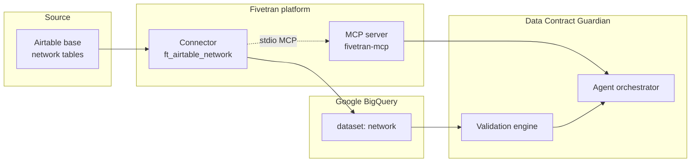

# Fivetran & BigQuery setup guide

End-to-end wiring for **Data Contract Guardian**: stand up **Fivetran → BigQuery data
ingestion**, connect the **Fivetran MCP server** to the agent, and enable **live contract
validation** against real warehouse tables.

> **You do not need any of this to run the demo.** The app ships with `MOCK_FIVETRAN_MCP=true`
> and `MOCK_BIGQUERY=true`, which serve realistic mock warehouse state and MCP evidence bundles
> so anyone can reproduce incidents with zero credentials. Follow this guide when you want the
> agent to investigate **live** Fivetran connectors and validate contracts against **real**
> BigQuery tables.

## Contents

1. [Architecture](#how-fivetran-fits-the-architecture)
2. [Prerequisites](#prerequisites)
3. [Step 1 — Fivetran API key](#step-1--create-a-fivetran-api-key--secret)
4. [Step 2 — Data ingestion (Airtable → BigQuery)](#step-2--data-ingestion-setup-airtable--bigquery)
5. [Step 3 — Align data contracts](#step-3--align-data-contracts-with-your-pipeline)
6. [Step 4 — Enable live BigQuery validation](#step-4--enable-live-bigquery-validation)
7. [Step 5 — Fivetran MCP server](#step-5--run-the-fivetran-mcp-server)
8. [Step 6 — Connect MCP to the agent](#step-6--connect-the-mcp-server-to-data-contract-guardian)
9. [Verify end-to-end](#verifying-the-integration)
10. [Security & troubleshooting](#security--least-privilege)

---

## How Fivetran fits the architecture

Fivetran plays **two roles** in this project:

| Role | What happens | Used by |
| ---- | ------------ | ------- |
| **Data ingestion (ELT)** | Connectors sync source systems into BigQuery datasets | Contract validation (`INFORMATION_SCHEMA`, semantic SQL) |
| **Agent telemetry (MCP)** | MCP tools return connector health, sync state, schema config | Agent investigation + evidence bundles |



**End-to-end data path:**

```
Airtable  →  Fivetran connector (ft_airtable_network)  →  BigQuery destination schema  →  Contract validation  →  Agent (MCP evidence on failure)
```

This repo guards **one connector** and **one dataset**:

| Fivetran connector id | Source | BigQuery dataset | Tables guarded by contracts |
| --------------------- | ------ | ---------------- | --------------------------- |
| `ft_airtable_network` | Airtable | `network` | `cdr`, `data_session`, `cell_tower`, `network_alarm`, `signal_sample` |

> Contracts use the friendly alias **`ft_airtable_network`**. At runtime the backend resolves
> this to your real Fivetran connection slug via `list_connections`, or you can set
> **`FIVETRAN_CONNECTION_ID`** in the environment (recommended for production). The `bq_project`
> field auto-resolves from `GCP_PROJECT_ID` when left as `demo-gcp-project`.

---

## Prerequisites

**Google Cloud**

- A GCP project with **billing enabled**
- APIs: BigQuery, IAM (enabled automatically when you use BigQuery)
- Permission to create datasets and grant IAM to the Fivetran service account

**Fivetran**

- A [Fivetran account](https://www.fivetran.com/) (14-day trial works)
- Account role: **Account Administrator** or equivalent (API + connector management)

**Airtable**

- An [Airtable base](https://airtable.com/) with tables that map to the network mart (see Step 2.3)
- Tables synced via Fivetran's **Airtable connector** into your BigQuery destination schema (e.g. `airtable_network_appxzsmwynqrvmfcq`; contract YAML may still say `network` — override with **`BQ_DATASET`**)

**Local tooling** (for MCP on your laptop only)

- [`uv`](https://docs.astral.sh/uv/) — provides `uvx` to launch the MCP server locally
- The backend Docker image installs `fivetran-mcp` directly; `uv` is not required on Cloud Run

---

## Step 1 — Create a Fivetran API key & secret

The Fivetran API (and the MCP server) authenticate with an **API key + API secret** pair.

1. Sign in to the [Fivetran dashboard](https://fivetran.com/dashboard).
2. Open your **profile menu** (top-right) → **API Key** (or **Settings → API Key**).
3. Click **Generate API Key**. Fivetran shows the **key** and **secret** **once** — copy both
   immediately and store them in a password manager / secret store.
4. Treat them like passwords. The pair grants programmatic access to your account; this project
   uses them **read-only** (see [Security](#security--least-privilege)).

> **Scope tip:** if your plan supports it, prefer a **scoped / team API key** limited to the
> connectors and groups this agent needs, rather than an account-wide key.

You now have:

```
FIVETRAN_API_KEY= ...        # the key
FIVETRAN_API_SECRET= ...     # the secret
```

The Fivetran API uses HTTP Basic auth with these as `base64(key:secret)`; the MCP server handles
that for you — you just provide the two values as environment variables.

---

## Step 2 — Data ingestion setup (Airtable → BigQuery)

This section walks through the **ELT pipeline** you already enabled: Airtable → Fivetran →
BigQuery destination dataset. Complete alignment with contracts before live validation
([Step 4](#step-4--enable-live-bigquery-validation)).

### 2.1 Prepare Google BigQuery

1. **Create or select a GCP project**. Note the project id — you will use it in Fivetran,
   contract YAML, and `GCP_PROJECT_ID`.

2. **Pick a region** aligned with this repo's defaults: **`us-central1` (US)**.

3. **Create the `network` dataset** in the [BigQuery console](https://console.cloud.google.com/bigquery)
   (or with `bq`):

   ```bash
   export GCP_PROJECT_ID=my-gcp-project
   export BQ_LOCATION=us-central1

   bq mk --project_id="$GCP_PROJECT_ID" --location="$BQ_LOCATION" --dataset network
   ```

   Fivetran may create the dataset automatically during connector setup; pre-creating it gives
   you explicit control over location and IAM.

### 2.2 Configure the Fivetran BigQuery destination

1. In the [Fivetran dashboard](https://fivetran.com/dashboard), go to **Destinations → Add destination**
   (skip if already configured).
2. Choose **Google BigQuery**.
3. Authorize Fivetran's service account in GCP (**IAM → grant** `bigquery.dataEditor` +
   `bigquery.jobUser`).
4. Set **Dataset location** to **`US`** / `us-central1` (match Cloud Run and Vertex AI).
5. Confirm destination status **Connected**.

> Reference: [Fivetran BigQuery destination](https://fivetran.com/docs/destinations/bigquery)

### 2.3 Add the Airtable connector (network tables)

1. **Connectors → Add connector → Airtable**.
2. Authorize your Airtable account (OAuth).
3. Select the **base** containing your network tables.
4. Select your **BigQuery destination** from Step 2.2.
5. In the **Schema** tab:
   - Enable Airtable tables that map to contract expectations (see table below).
   - Set the **destination schema** / **dataset** to **`network`**.
   - Fivetran lands tables in BigQuery with normalized lowercase names (`cdr`, `data_session`, …).
6. Run **Initial sync** and wait until status is **Connected** / **Active**.
7. Open **Setup → Details** and copy the **connector id**. Update every contract's
   `fivetran_connector_id` to match (default in this repo: `ft_airtable_network`).

| Airtable table (your base) | BigQuery table | Contract file |
| -------------------------- | -------------- | ------------- |
| CDR / call records | `cdr` | `network_cdr_schema_v1.yaml`, `network_cdr_freshness_v1.yaml` |
| Data sessions | `data_session` | `network_data_session_v1.yaml` |
| Cell towers | `cell_tower` | `network_cell_tower_v1.yaml` |
| Network alarms | `network_alarm` | `network_alarm_v1.yaml` |
| Signal samples | `signal_sample` | `network_signal_sample_v1.yaml` |

If your Airtable table names differ, either rename tables in the Fivetran schema config to match
the BigQuery names above, or update `bq_table` in the matching contract YAML.

> Airtable connector docs: [Fivetran Airtable](https://fivetran.com/docs/connectors/applications/airtable)

### 2.4 Schema sync & column mapping checklist

After initial sync, confirm each guarded table exists with columns the contracts expect:

| BigQuery table | Key columns (from contracts) |
| -------------- | ---------------------------- |
| `cdr` | `cdr_id`, `subscriber_id`, `duration_seconds`, `bytes_transferred`, `charge_amount` |
| `data_session` | `session_id`, `subscriber_id`, `apn`, `rx_bytes`, `tx_bytes`, `data_charge` |
| `cell_tower` | tower / cell identifiers per contract |
| `network_alarm` | alarm metadata per contract |
| `signal_sample` | signal metrics per contract |

In the Fivetran **Schema** tab you can enable/disable columns and trigger **Resync** after
schema changes. Type drift (e.g. `charge_amount` changing from FLOAT to STRING in BigQuery) is
exactly what Data Contract Guardian detects and investigates with Fivetran MCP evidence.

### 2.5 Verify ingestion in BigQuery

Run these in the BigQuery console (replace project id):

```sql
-- Tables landed by Fivetran
SELECT table_schema, table_name, row_count, TIMESTAMP_MILLIS(last_modified_time) AS last_modified
FROM `my-gcp-project.network.__TABLES__`
ORDER BY table_name;

-- Column types for a guarded table (matches validation engine query)
SELECT column_name, data_type
FROM `my-gcp-project.network.INFORMATION_SCHEMA.COLUMNS`
WHERE table_name = 'cdr'
ORDER BY ordinal_position;
```

Healthy signals:

- Row counts > 0 after initial sync
- `last_modified` within your contract's freshness window (e.g. 120 minutes for `cdr`)
- Column names and types match contract YAML (`charge_amount` as FLOAT, etc.)

Also check the Fivetran dashboard:

- Connector **Status** = Connected
- **Sync frequency** matches your SLA
- No unresolved **Warnings** on the Schema tab

---

## Step 3 — Align data contracts with your pipeline

Each contract in [`contracts/`](../contracts/) binds validation to a specific table and
Fivetran connector:

```yaml
contract_id: network_cdr_schema_v1
warehouse: bigquery
fivetran_connector_id: ft_airtable_network   # friendly alias — resolved at runtime (see FIVETRAN_CONNECTION_ID)
bq_project: my-gcp-project                     # ← your GCP project id
bq_dataset: network
bq_table: cdr
freshness:
  max_delay_minutes: 120
schema:
  required_columns: [cdr_id, subscriber_id, ...]
  column_types:
    charge_amount: FLOAT
```

**Update every contract** (or use search-replace):

| Field | Change to |
| ----- | --------- |
| `bq_project` | Your GCP project id (or leave `demo-gcp-project` — auto-resolves from `GCP_PROJECT_ID`) |
| `fivetran_connector_id` | Keep `ft_airtable_network` alias, or set `FIVETRAN_CONNECTION_ID` env to your dashboard slug |

Quick bulk update example:

```bash
# Preview
grep -r "demo-gcp-project" contracts/
grep -r "ft_airtable_network" contracts/

# Replace project id across all contracts
sed -i '' 's/demo-gcp-project/my-gcp-project/g' contracts/*.yaml
```

Restart the backend after editing contracts (files are read from disk on each validation run).

---

## Step 4 — Enable live BigQuery validation

By default `MOCK_BIGQUERY=true` reads warehouse state from SQLite demo seeds. To validate against
real BigQuery tables populated by Fivetran:

### 4.1 IAM for Data Contract Guardian

The backend needs read access to synced datasets:

| Role | Purpose |
| ---- | ------- |
| `roles/bigquery.dataViewer` | Read table data + `INFORMATION_SCHEMA` |
| `roles/bigquery.jobUser` | Run semantic SQL checks |

On Cloud Run, Terraform grants these to the backend service account automatically. Locally, use
Application Default Credentials:

```bash
gcloud auth application-default login
gcloud config set project my-gcp-project
```

### 4.2 Environment variables

In `backend/.env` or `terraform.tfvars`:

```bash
GCP_PROJECT_ID=my-gcp-project
GCP_LOCATION=us-central1
MOCK_BIGQUERY=false
# Fivetran destination schema slug (when contract YAML still has bq_dataset: network)
BQ_DATASET=airtable_network_appxzsmwynqrvmfcq
```

`contracts_loader.py` rewrites placeholder `bq_dataset: network` → `BQ_DATASET` at load time. You can also edit `contracts/*.yaml` directly.

The validation engine (`bigquery_validation.py`) then:

1. Reads column names/types from `INFORMATION_SCHEMA.COLUMNS`
2. Reads freshness from `__TABLES__.last_modified_time`
3. Runs semantic SQL rules from contract YAML against fully qualified table names

### 4.3 Smoke test

```bash
cd backend && PYTHONPATH=. uvicorn app.main:app --reload --port 8000

# Validate all contracts against live BigQuery
curl -X POST http://127.0.0.1:8000/api/validation/run | jq '.results[] | {contract_id, passed}'

# Platform status should show live BigQuery
curl -s http://127.0.0.1:8000/api/agent/platform | jq '.bigquery'
```

Expect `"mock_mode": false` and `"live_available": true`.

> **Hybrid mode:** You can run **live MCP + mock BigQuery** (or the reverse) by toggling
> `MOCK_FIVETRAN_MCP` and `MOCK_BIGQUERY` independently — useful while standing up one side
> of the pipeline at a time.

---

## Step 5 — Run the Fivetran MCP server

The agent talks to Fivetran through the official **Model Context Protocol** server,
[`github.com/fivetran/fivetran-mcp`](https://github.com/fivetran/fivetran-mcp), over **stdio**.

You don't start it by hand — Data Contract Guardian spawns it as a subprocess using the command
in your config (default below) and passes credentials via environment variables. To verify the
server runs and lists tools, you can launch it directly:

```bash
export FIVETRAN_API_KEY=...        # from Step 1
export FIVETRAN_API_SECRET=...
export FIVETRAN_ALLOW_WRITES=false # keep read-only (default)

uvx --from git+https://github.com/fivetran/fivetran-mcp fivetran-mcp
```

This is exactly the command the app runs, defined by:

| Setting | Default |
| ------- | ------- |
| `FIVETRAN_MCP_COMMAND` | `uvx` |
| `FIVETRAN_MCP_ARGS` | `--from,git+https://github.com/fivetran/fivetran-mcp,fivetran-mcp` (comma-separated argv) |

The agent uses three **read-only** investigation tools from the server:

| MCP tool | What it returns | Used for |
| -------- | --------------- | -------- |
| `get_connection_details` | sync status, setup state, last sync time | "is the connector healthy / stale?" |
| `get_connection_state`   | detailed sync/update state | freshness & delay grounding |
| `get_connection_schema_config` | enabled tables, schema config, recent errors | schema-drift / type-mismatch grounding |

---

## Step 6 — Connect the MCP server to Data Contract Guardian

### Local

Copy the template and fill in the Fivetran block in `backend/.env`
(see [`.env.example`](../.env.example)):

```bash
# Flip off the mock to use the real MCP server
MOCK_FIVETRAN_MCP=false
FIVETRAN_API_KEY=your_key
FIVETRAN_API_SECRET=your_secret

# Read-only by default — leave false unless you intend to allow writes
FIVETRAN_ALLOW_WRITES=false

# How the MCP server is launched (defaults shown; usually leave as-is)
FIVETRAN_MCP_COMMAND=uvx
FIVETRAN_MCP_ARGS=--from,git+https://github.com/fivetran/fivetran-mcp,fivetran-mcp
```

Requirements for the live path to activate (all checked in code):

- `MOCK_FIVETRAN_MCP=false` **and** both `FIVETRAN_API_KEY` + `FIVETRAN_API_SECRET` set, and
- the `mcp` Python package importable (it's in [`requirements.txt`](../backend/requirements.txt)).

If any are missing, the app **automatically falls back to mock** — it never crashes the demo.

Start the backend and confirm the transport is live:

```bash
cd backend && PYTHONPATH=. uvicorn app.main:app --reload --port 8000
curl -s http://127.0.0.1:8000/api/agent/platform | jq '.fivetran_mcp'
```

Expect `"transport": "stdio"` and a populated `discovered_tools` list when credentials are valid.
(With the mock it reads `"transport": "mock"`.)

### Production (Cloud Run + Secret Manager)

Credentials are **never** placed in plaintext env on Cloud Run — Terraform stores them in
**Secret Manager** and mounts them as secret env vars. In
[`terraform/terraform.tfvars`](../terraform/terraform.tfvars.example):

```hcl
mock_fivetran_mcp      = false
mock_bigquery          = false
fivetran_connection_id = "toll_donator"
bq_dataset             = "airtable_network_appxzsmwynqrvmfcq"
gemini_model           = "gemini-2.5-flash"
# fivetran_api_key / fivetran_api_secret — prefer TF_VAR_* env vars
```

Then:

```bash
export TF_VAR_fivetran_api_key=...     # avoids committing secrets to tfvars
export TF_VAR_fivetran_api_secret=...
cd terraform && terraform apply
```

Terraform will:

1. Create secrets `dcg-fivetran-api-key` and `dcg-fivetran-api-secret`.
2. Grant the backend service account `roles/secretmanager.secretAccessor`.
3. Inject both into the Cloud Run backend as `FIVETRAN_API_KEY` / `FIVETRAN_API_SECRET`.
4. Fail fast if `mock_fivetran_mcp=false` but either secret is empty.

The backend Docker image already bundles the `fivetran-mcp` server, so the container launches it
without network fetching at runtime.

---

## Verifying the integration

### Ingestion (Fivetran → BigQuery)

```bash
# BigQuery: confirm tables exist and were recently updated
bq query --use_legacy_sql=false '
SELECT table_id, row_count, TIMESTAMP_MILLIS(last_modified_time) AS modified
FROM `my-gcp-project.network.__TABLES__`
ORDER BY table_id'

# Fivetran REST (optional): list connectors — same account the MCP server uses
curl -u "$FIVETRAN_API_KEY:$FIVETRAN_API_SECRET" \
  https://api.fivetran.com/v1/connectors | jq '.data.items[] | {id, schema, status}'
```

### Agent + MCP + validation

```bash
# 1. Platform snapshot — live BigQuery + live MCP
curl -s https://YOUR-HOST/api/agent/platform | jq '.fivetran_mcp, .bigquery, .gemini'

# 2. Run validation against live warehouse (may open incidents on real drift)
curl -X POST https://YOUR-HOST/api/validation/run | jq '.results[] | {contract_id, passed}'

# 3. Or drive the demo incident path on a single contract
curl -X POST https://YOUR-HOST/api/demo/seed-failing/network_cdr_schema_v1
curl -X POST https://YOUR-HOST/api/agent/run-pipeline

# 4. Open the incident in the UI → transcript shows three
#    "Fivetran MCP → get_connection_*" tool calls + evidence bundles
```

Healthy signals:

| Layer | What to check |
| ----- | ------------- |
| **Ingestion** | BigQuery tables have rows; Fivetran connector status Connected |
| **Validation** | `bigquery.mock_mode == false`; validation reads live schema |
| **MCP** | `fivetran_mcp.transport == "stdio"`; evidence `"mcp_mode": "live_stdio"` |
| **Agent** | Incident transcript links MCP bundles to RCA claims |

---

## Security & least-privilege

- **Read-only by design.** `FIVETRAN_ALLOW_WRITES` defaults to `false`; the server is launched
  with that flag so the agent can inspect connectors but not mutate them. Keep it `false` unless
  you have a specific, reviewed reason to allow writes — and even then, the agent's side effects
  stay behind the human-in-the-loop approval gate.
- **Secrets never in source.** Use `TF_VAR_*` env vars or Secret Manager; do not commit keys to
  `terraform.tfvars` or `.env`. Both are git-ignored, but treat them as sensitive regardless.
- **Scope the key** to the minimum connectors/groups the agent needs.
- **Rotate** the API key periodically; update the Secret Manager versions and redeploy.

---

## Troubleshooting

| Symptom | Likely cause / fix |
| ------- | ------------------ |
| BigQuery tables empty after sync | Initial sync still running, or schema tab has tables disabled. Check Fivetran logs. |
| `INFORMATION_SCHEMA` returns no columns | Wrong `bq_project` / `bq_dataset` / `bq_table` in contract YAML. |
| Validation always passes/fails unexpectedly | Still on mock warehouse — set `MOCK_BIGQUERY=false` and restart backend. |
| Permission denied on BQ queries | Grant `bigquery.dataViewer` + `bigquery.jobUser` to your ADC principal or Cloud Run SA. |
| Fivetran SA cannot write to BQ | Re-run destination setup; confirm `bigquery.dataEditor` on Fivetran service account. |
| `transport: "mock"` despite setting creds | `MOCK_FIVETRAN_MCP` still `true`, or one of key/secret is empty. Both are required. |
| `mcp_mode: "live_stdio_error"` in evidence | MCP server ran but tool call failed — verify **connector id** exists and key has access. |
| "MCP SDK unavailable" | Install `mcp` package (`pip install -r backend/requirements.txt`). |
| `uvx: command not found` (local) | Install `uv`; or set `FIVETRAN_MCP_COMMAND` to a local `fivetran-mcp` binary. |
| 401 / auth errors from MCP | Wrong key/secret, or key was rotated. Regenerate (Step 1) and update secrets. |
| Terraform apply error about empty secret | `mock_fivetran_mcp=false` without both `fivetran_api_key` and `fivetran_api_secret`. |
| MCP `schema_file` validation error | GitHub fivetran-mcp requires `schema_file` on every call — fixed in `fivetran_mcp_stdio.py`. Redeploy backend. |
| Connector id mismatch | Set `FIVETRAN_CONNECTION_ID` to your dashboard slug (see above). |

---

## References

- [Fivetran Airtable connector](https://fivetran.com/docs/connectors/applications/airtable)
- [Fivetran BigQuery destination setup](https://fivetran.com/docs/destinations/bigquery)
- [Fivetran MCP server](https://github.com/fivetran/fivetran-mcp)
- [Fivetran REST API & authentication](https://fivetran.com/docs/rest-api)
- [Model Context Protocol](https://modelcontextprotocol.io/)
- This repo: [`contracts/`](../contracts/) · [`.env.example`](../.env.example) · [Deployment](./DEPLOYMENT.md) · [Implementation](./IMPLEMENTATION.md)
