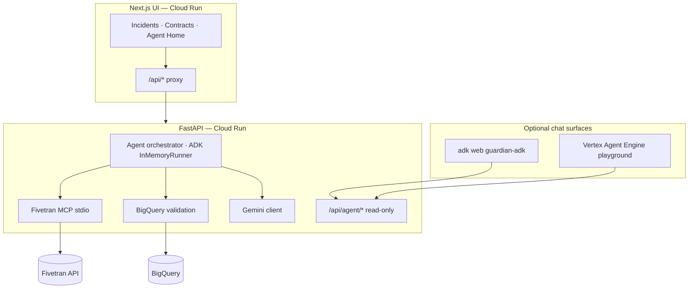

# Documentation

Engineering and operations guides for **Data Contract Guardian** — an AI reliability agent for Fivetran → BigQuery pipelines (Google Cloud Rapid Agent Hackathon, Fivetran track).

**Live demo:** [UI](https://data-contract-guardian-ui-920722415791.us-central1.run.app) · [API / Swagger](https://data-contract-guardian-api-920722415791.us-central1.run.app/docs)

---

## Start here (by role)

| You are… | Read first | Then |
| -------- | ---------- | ---- |
| **New developer** | [DEPLOYMENT.md](./DEPLOYMENT.md) § Local | [IMPLEMENTATION.md](./IMPLEMENTATION.md) · [FIVETRAN.md](./FIVETRAN.md) |
| **GCP operator** | [terraform/README.md](../terraform/README.md) | [DEPLOYMENT.md](./DEPLOYMENT.md) § GCP |
| **Agent Builder / ADK** | [agent-builder-setup.md](./agent-builder-setup.md) | [guardian-adk/README.md](../guardian-adk/README.md) · [openapi/agent-api.yaml](./openapi/agent-api.yaml) |

---

## Guide index

| Guide | Description |
| ----- | ----------- |
| [Architecture](./ARCHITECTURE.md) | System diagram, components, data flows, ADK surfaces |
| [Implementation](./IMPLEMENTATION.md) | Code layout, APIs, orchestrator, SQLite model, extension points |
| [Deployment](./DEPLOYMENT.md) | Local dev, Docker, Cloud Build, Terraform, Cloud Run, troubleshooting |
| [Fivetran & BigQuery](./FIVETRAN.md) | Ingestion, `BQ_DATASET`, live MCP, connection resolution |
| [Agent Builder setup](./agent-builder-setup.md) | Local ADK Web UI + Vertex Agent Engine playground |
| [Schemas](./SCHEMAS.md) | Contract YAML reference |
| [Agent API (OpenAPI)](./openapi/agent-api.yaml) | Read-only `/api/agent/*` for chat agents |
| [OpenAPI notes](./openapi/README.md) | How to use the agent API spec |
| [Terraform](../terraform/README.md) | IaC quick start, secrets, outputs |
| [Production ADK](../backend/agent_builder/README.md) | In-process ADK (`run_guardian_turn`) on Cloud Run |
| [Chat ADK package](../guardian-adk/README.md) | Standalone `guardian_assistant` for `adk web` / Agent Engine |

---

## Architecture at a glance

**Human-in-the-loop:** chat and discover APIs are read-only. Approval and remediation execute only via the UI or `POST /api/incidents/approve-remediation`.

---

## Scripts reference

| Script | Purpose |
| ------ | ------- |
| [`scripts/gcp-push-images.sh`](../scripts/gcp-push-images.sh) | Build + push backend/frontend to Artifact Registry |
| [`scripts/adk-playground-local.sh`](../scripts/adk-playground-local.sh) | Local `adk web guardian-adk` on port 8081 |
| [`scripts/deploy-adk-agent-engine.sh`](../scripts/deploy-adk-agent-engine.sh) | Deploy to Vertex Agent Engine (uses `.adk-deploy-venv/`) |

---

## Environment & secrets

* Templates: [`.env.example`](../.env.example)
* **Never commit:** `.env`, `terraform.tfvars`, API keys
* **Cloud Run secrets:** Terraform → Secret Manager → `GEMINI_API_KEY`, `FIVETRAN_API_KEY`, `FIVETRAN_API_SECRET`
* Pass at apply time: `TF_VAR_gemini_api_key`, `TF_VAR_fivetran_api_key`, `TF_VAR_fivetran_api_secret`

---

## Quick links

| Resource | Path |
| -------- | ---- |
| Root README | [../README.md](../README.md) |
| Dockerfiles | [../deploy/](../deploy/) |
| CI workflow | [../.github/workflows/ci.yml](../.github/workflows/ci.yml) |
| Cloud Build | [../cloudbuild.yaml](../cloudbuild.yaml) |
| License | [../LICENSE](../LICENSE) (MIT) |
