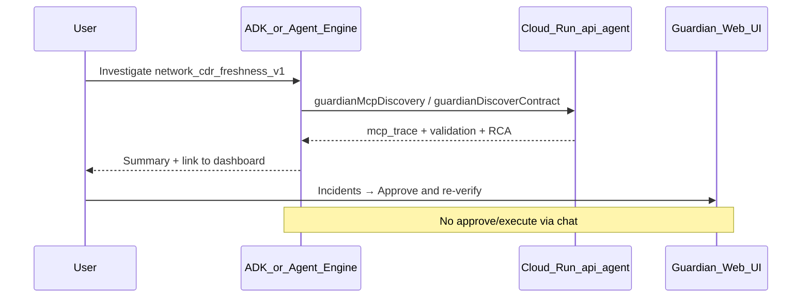

# Data Contract Guardian — ADK chat (Agent Builder playground)

Use a **conversational front-end** that calls the hosted Guardian read-only API. **Approval, remediation execution, and incident resolution stay in the web UI** — the chat agent never gets write access.

Pattern from [consentops-agent](https://github.com/prabhakaran-jm/consentops-agent).

| Role | Surface |
| ---- | ------- |
| Chat (discover + investigate) | **ADK Web UI** (local) or **Vertex AI Agent Engine** playground |
| Approve → re-verify → resolve | [Guardian dashboard](https://data-contract-guardian-ui-920722415791.us-central1.run.app) |

---

## Architecture



Guardian on Cloud Run owns Gemini planning, BigQuery validation, and Fivetran MCP at runtime. The chat layer orchestrates read-only `/api/agent/*` tools.

---

## Prerequisites

- GCP project with billing
- Live Cloud Run API returns **200** on `GET /api/agent/platform`
- For **local ADK**: `GEMINI_API_KEY` or Vertex ADC (`gcloud auth application-default login`)
- For **Agent Engine**: Terraform ADK staging bucket + `gcloud auth application-default login`

Verify the API:

```bash
curl -s https://data-contract-guardian-api-920722415791.us-central1.run.app/api/agent/platform | head -c 400
```

---

## Path A — Local ADK Web UI (recommended for dev)

```bash
pip install -r guardian-adk/guardian_assistant/requirements.txt
export GEMINI_API_KEY=your_key          # or Vertex ADC
export FIVETRAN_API_KEY=...             # optional native MCP
export FIVETRAN_API_SECRET=...
./scripts/adk-playground-local.sh
```

Open http://127.0.0.1:8081 → select **guardian_assistant**.

**Windows:** port 8000 is often blocked — the script defaults to **8081**.

### Sample prompt

> Run MCP discovery for `toll_donator`, then investigate `network_cdr_freshness_v1`. Do not approve anything.

**Expect:**

- Calls `guardianMcpDiscovery` and/or `guardianDiscoverContract`
- Quotes live `mcp_trace` and `failed_checks` from tool output
- Links to the **Guardian dashboard** for approval

Implementation: [guardian-adk/guardian_assistant/agent.py](../guardian-adk/guardian_assistant/agent.py).

---

## Path B — Vertex AI Agent Engine (hosted playground)

Publishes the **same agent** as `adk web` to Google Cloud. Open **Vertex AI → Agent Engine** and chat in the console playground.

### One-time infra

```bash
cd terraform && terraform apply && cd ..
gcloud auth application-default login
```

Terraform creates `adk_staging_bucket` and enables Vertex AI + Cloud Storage APIs.

### Deploy

```bash
chmod +x scripts/deploy-adk-agent-engine.sh
./scripts/deploy-adk-agent-engine.sh --recreate
```

The script creates `.adk-deploy-venv/` with `google-adk` + `google-cloud-aiplatform[agent_engines]` (isolated from Cloud Shell global Python).

- Reads `GCP_PROJECT_ID` from `.env`
- Staging bucket from `terraform output -raw adk_staging_bucket`
- Saves engine id to `guardian-adk/.agent_engine_id`
- Prints console playground URL

**After `agent.py` or `requirements.txt` changes**, always use `--recreate` (or `ADK_RECREATE=true`). `update()` does not rebuild the container.

### Fivetran MCP on Engine

Native stdio MCP is **off by default** on Agent Engine (`ADK_FIVETRAN_MCP_ENABLED=false`). Installing `fivetran-mcp` into the Engine venv pulls `fastmcp`/`httpx` versions that conflict with the ADK runtime.

Instead, the agent calls Cloud Run `POST /api/agent/fivetran` via FunctionTools — same read-only Fivetran tools, isolated MCP process on Cloud Run.

---

## Troubleshooting

| Symptom | Fix |
| ------- | --- |
| `ModuleNotFoundError: vertexai.agent_engines` | Run `./scripts/deploy-adk-agent-engine.sh` (uses `.adk-deploy-venv/` with minimal deps) |
| `No module named 'google.adk'` during deploy | Stale venv — `rm -rf .adk-deploy-venv && ./scripts/deploy-adk-agent-engine.sh --recreate` |
| pip conflicts with tensorflow/streamlit on Cloud Shell | Never install into global Python; use the deploy script venv only |
| Port bind error on 8000 | Use `./scripts/adk-playground-local.sh` (port 8081) |
| `400 Environment variable name 'GOOGLE_CLOUD_PROJECT' is reserved` | Deploy script uses `CLOUD_ML_PROJECT_ID`, not reserved names |
| Playground **404** on `gemini-3.5-flash` | Agent Engine uses Vertex — set `ADK_GEMINI_MODEL=gemini-2.5-flash` |
| Model/code change doesn't take effect | Delete engine + `.agent_engine_id`, redeploy with `--recreate` |
| Framework shows **custom** not **google-adk** | Redeploy with deploy script (patches `ModuleAgent.clone`) |
| Fivetran proxy **503** / OOM on Cloud Run | Raise backend memory to **1–2Gi** in `terraform/main.tf` |
| Agent hallucinates execution | Reiterate: approval is **UI only** |

---

## What stays out of chat (by design)

| Capability | Why |
| ---------- | --- |
| `POST /api/incidents/approve-remediation` | Human approval gate |
| Fivetran sync / writes | Read-only partner posture |
| BigQuery DML | Approval-gated in UI |

OpenAPI reference: [docs/openapi/agent-api.yaml](./openapi/agent-api.yaml).
